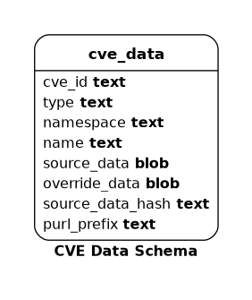

# Integration guide

This document provides useful information to help integrate VDB with your products and services.

## Pre-requisite

When used as a Python library, the only dependency is Python >= 3.10. When using the sqlite database directly in your application, ensure the version of the SQLite3 [library](https://www.sqlite.org/download.html) is greater than 3.45.2.

## Database files

The vulnerability database comprises two SQLite database files.

- data.index.vdb6 - A smaller index database optimized for quick purl or cpe string searches and vers-based range comparisons.


- data.vdb6 - Full CVE source database containing normalized data in CVE 5.0 specification formation and purl prefix.



## Searching for CVEs

Use the smaller index database for all search operations.

### Searching by purl

Given a purl string (`purl_str`), perform the following steps to convert this into a suitable purl prefix (`purl_prefix`) string:

In most cases, a purl prefix is a substring at index 0 after a split by "@". Eg: `purl_prefix = purl_str.split("@")[0]`.

A more robust approach:

- Parse and validate the string using a suitable [library](https://github.com/package-url/). Retain the parsed purl object (`purl_obj`)
- Construct a purl prefix string with the following logic:
  - Set the value for `purl_prefix` to `"pkg:" + purl_obj["type"]`
  - If there is a namespace, append it to purl_prefix after the slash character. Eg: `purl_prefix = purl_prefix + "/" + purl_obj['namespace']`
  - Optional for Linux distros: If there is a qualifier string with the name `distro_name`, append it to the purl_prefix after the slash character. Eg: `purl_prefix = purl_prefix + "/" + purl_obj['qualifiers']['distro_name']`
  - Append the name after the slash character. Eg: `purl_prefix = purl_prefix + "/" + purl_obj['name']`

Use the below SQL query to search by purl_prefix:

```
SELECT DISTINCT cve_id, type, namespace, name, vers, purl_prefix FROM cve_index where purl_prefix = ?;
```

### Searching by cpe

Parse the cpe string to extract the vendor, product, and version. The regex for python is shown below:

```python
import re

CPE_FULL_REGEX = re.compile(
    "cpe:?:[^:]+:(?P<cve_type>[^:]+):(?P<vendor>[^:]+):(?P<package>[^:]+):(?P<version>[^:]+):(?P<update>[^:]+):(?P<edition>[^:]+):(?P<lang>[^:]+):(?P<sw_edition>[^:]+):(?P<target_sw>[^:]+):(?P<target_hw>[^:]+):(?P<other>[^:]+)"
)
```

In the `cve_index` table, vendor maps to namespace and package maps to name. The SQL query is below:

```sql
SELECT DISTINCT cve_id, type, namespace, name, vers, purl_prefix FROM cve_index where namespace = ? AND name = ?;
```

### Comparing version ranges using vers

Refer to the vers [documentation](https://github.com/package-url/purl-spec/blob/version-range-spec/VERSION-RANGE-SPEC.rst) for information regarding vers and a logic to parse and check if a version is within a range. To simplify the logic, a value from the vers column in `cve_index` would contain only a maximum of two constraints (one greater than and one lesser than).

## Combining data

Search the `cve_index` table in the index database first to retrieve any matching cve_id and purl_prefix values. Use these two column values to retrieve the full CVE source information from the `cve_data` table. An example query is shown below:

```sql
SELECT DISTINCT cve_id, type, namespace, name, source_data_hash, json(source_data), json(override_data), purl_prefix FROM cve_data
    WHERE cve_id = ? AND purl_prefix = ?
    GROUP BY purl_prefix
    ORDER BY cve_id DESC;
```

Use the `source_data_hash` values to filter out any duplicate results for the same CVE. Duplicate results are possible when multiple vers match the same CVE and purl prefixes.
