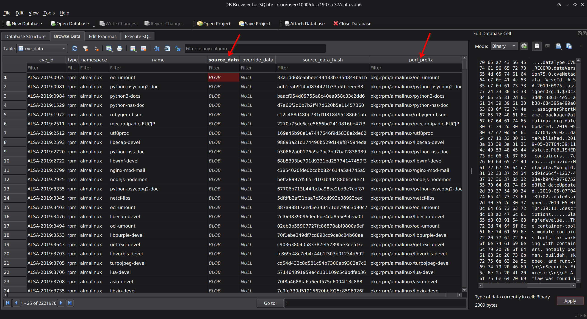

# Introduction

This repo is a vulnerability database and package search for sources such as AppThreat vuln-list, OSV, NVD, and GitHub. Vulnerability data are downloaded from the sources and stored in a sqlite based storage with indexes to allow offline access and efficient searches.

## Why vulnerability db?

A good vulnerability database must have the following properties:

- Accuracy
- Easy to [download](#download-pre-built-database-recommended), [integrate](./INTEGRATION.md), and use
- Performance

Multiple upstream sources are used by vdb to improve accuracy and reduce false negatives. SQLite database containing data in CVE 5.0 schema format is precompiled and distributed as files via ghcr to simplify download. With automatic purl prefix generation even for git repos, searches on the database can be performed with purl, cpe, or even http git url string. Every row in the database uses an open specification such as CVE 5.0 or Package URL (purl and vers) thus preventing the possibility of vendor lock-in.

## Vulnerability Data sources

- Linux [vuln-list](https://github.com/appthreat/vuln-list) (Forked from AquaSecurity)
- OSV (1)
- NVD
- GitHub

1 - We exclude Linux and oss-fuzz feeds by default. Set the environment variable `OSV_INCLUDE_FUZZ` to include them.

## Linux distros

- AlmaLinux
- Debian
- Alpine
- Amazon Linux
- Arch Linux
- RHEL/CentOS
- Rocky Linux
- Ubuntu
- OpenSUSE/SLES
- Photon
- Chainguard
- Wolfi OS

## Installation

```shell
pip install appthreat-vulnerability-db>=6.0.1
```

To install vdb with optional dependencies such as `oras` use the `[oras]` or `[all]` dependency group.

```shell
pip install appthreat-vulnerability-db[all]
```

**NOTE:** VDB v6 is a major rewrite to use sqlite database. Current users of depscan v5 must continue using version 5.6.x

```shell
pip install appthreat-vulnerability-db==5.6.7
```

## Usage

This package is ideal as a library for managing vulnerabilities. This is used by [owasp-dep-scan](http://github.com/owasp-dep-scan/dep-scan), a free open-source dependency audit tool. However, there is a limited cli capability available with few features to test this tool directly.

### Option 1: Download pre-built database (Recommended)

To download a pre-built sqlite database ([refreshed](https://github.com/AppThreat/vdb/actions) every 6 hours) containing all application and OS vulnerabilities. This step is recommended for all users.

```shell
# pip install appthreat-vulnerability-db[all]
vdb --download-image
```

You can execute this command daily or when a fresh database is required.

### Option 2: Download pre-built database (ORAS)

Using [ORAS cli](https://oras.land/) might be slightly faster.

```
export VDB_HOME=$HOME/vdb
oras pull ghcr.io/appthreat/vdbxz:v6 -o $VDB_HOME
tar -xvf *.tar.xz
rm *.tar.xz
```

Use any sqlite browser or cli tools to load and query the two databases.

**data.index.vdb6** - index db with purl prefix and vers


**data.vdb6** - Contains source data in CVE 5.0 format stored as a jsonb blob.



### Option 3: Manually create the vulnerability database (ADVANCED users)

Cache application vulnerabilities

```shell
vdb --cache
```

The typical size of this database is over 1.1 GB.

Cache application and OS vulnerabilities

```shell
vdb --cache-os
```

Note the size of the database with OS vulnerabilities is over 5 GB.

Cache from just [OSV](https://osv.dev)

```shell
vdb --cache --only-osv
```

It is possible to customize the cache behavior by increasing the historic data period to cache by setting the following environment variables.

- NVD_START_YEAR - Default: 2018. Supports up to 2002
- GITHUB_PAGE_COUNT - Default: 2. Supports up to 20

## CLI Usage

```shell
usage: vdb [-h] [--clean] [--cache] [--cache-os] [--only-osv] [--only-aqua] [--only-ghsa] [--search SEARCH] [--list-malware] [--bom BOM_FILE]

AppThreat's vulnerability database and package search library with a built-in sqlite based storage.

options:
  -h, --help       show this help message and exit
  --clean          Clear the vulnerability database cache from platform specific user_data_dir.
  --cache          Cache vulnerability information in platform specific user_data_dir.
  --cache-os       Cache OS vulnerability information in platform specific user_data_dir.
  --only-osv       Use only OSV as the source. Use with --cache.
  --only-aqua      Use only Aqua vuln-list as the source. Use with --cache.
  --only-ghsa      Use only recent ghsa as the source. Use with --cache.
  --search SEARCH  Search for the package or CVE ID in the database. Use purl, cpe, or git http url.
  --list-malware   List latest malwares with CVE ID beginning with MAL-.
  --bom BOM_FILE   Search for packages in the CycloneDX BOM file.
  --download-image  Downloaded pre-created vdb image to platform specific user_data_dir.
```

### CLI search

It is possible to perform a range of searches using the cli.

```shell
vdb --search pkg:pypi/xml2dict@0.2.2

# Search based on a purl prefix
vdb --search pkg:pypi/xml2dict

# Full url and short form for swift
vdb --search "pkg:swift/github.com/vapor/vapor@4.39.0"

vdb --search "pkg:swift/vapor/vapor@4.89.0"

# Search by cpe
vdb --search "cpe:2.3:a:npm:gitblame:*:*:*:*:*:*:*:*"

# Search by colon separated values
vdb --search "npm:gitblame:0.0.1"

# Search by CVE id
vdb --search CVE-2024-25169

# Search with wildcard for CVE
vdb --search CVE-2024-%

# Search by git url
vdb --search "https://github.com/electron/electron"

# Search by CycloneDX SBOM
vdb --bom bom.json
```

### List recent malware

To list malware entries with the `MAL-` prefix, use the following command.

```shell
vdb --list-malware
```

## License

MIT

## Discord support

The developers could be reached via the [Discord](https://discord.gg/DCNxzaeUpd) channel for free and paid enterprise support.
