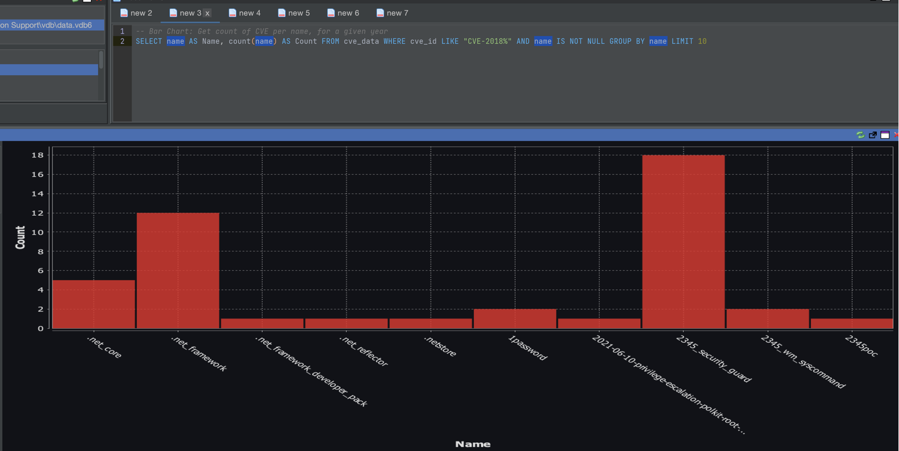
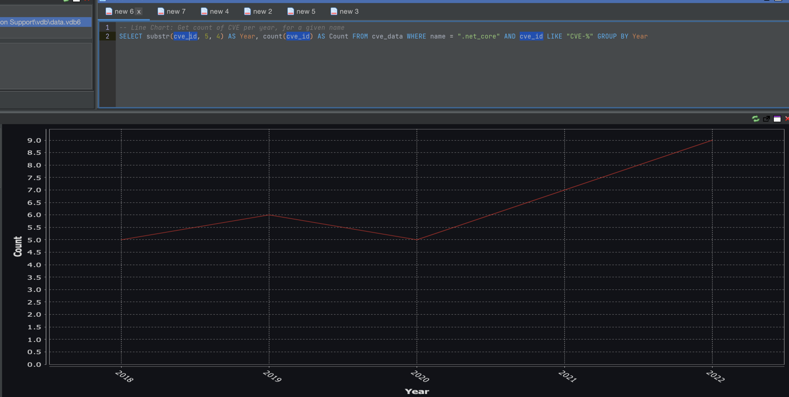

# Vulnerability DB Reporting and Metrics

Loading the populated SQLite vulnerability database into a tool like [qStudio](https://github.com/timeseries/qstudio) can allow for running metrics around specific aspects. The SQLite database can be found in the following location:
- Macintosh: `\Users\<user>\Library\Application Support\vdb\data.vdb`

The following are some interesting examples and example queries.

### Bar Chart for viewing counts of CVE

Get count of CVE per namespace, for a given year (2018 in this example)
```
SELECT namespace AS Namespace, count(namespace) AS Count FROM cve_data WHERE cve_id LIKE "CVE-2018%" AND namespace IS NOT NULL GROUP BY namespace LIMIT 10
```


Get count of CVE per name, for a given year (2018 in this example)
```
SELECT name AS Name, count(name) AS Count FROM cve_data WHERE cve_id LIKE "CVE-2018%" AND name IS NOT NULL GROUP BY name LIMIT 10
```



Get count of CVE per PURL, for a given year (2018 in this example)
```
SELECT purl_prefix AS PURL, count(purl_prefix) AS Count FROM cve_data WHERE cve_id LIKE "CVE-2018%" AND namespace IS NOT NULL GROUP BY purl_prefix LIMIT 10
```


### Line Chart for viewing trends of CVE counts per year

Show trend of CVE count per year, for a given namespace (this example shows namespace of debian)
```
SELECT substr(cve_id, 5, 4) AS Year, count(cve_id) AS Count FROM cve_data WHERE namespace = "debian" AND cve_id LIKE "CVE-%" GROUP BY Year
```


Show trend of CVE count per year, for a given name (this example shows name of .net_core)
```
SELECT substr(cve_id, 5, 4) AS Year, count(cve_id) AS Count FROM cve_data WHERE name = ".net_core" AND cve_id LIKE "CVE-%" GROUP BY Year
```



Show trend of of CVE count per year, for a given PURL (this example shows purl of pkg:alpm/arch/apache)
```
SELECT substr(cve_id, 5, 4) AS Year, count(cve_id) AS Count FROM cve_data WHERE purl_prefix = "pkg:alpm/arch/apache" AND cve_id LIKE "CVE-%" GROUP BY Year
```

